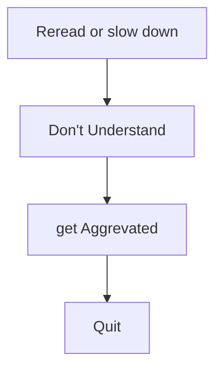

# The Craft of Writing Effectively
Reference:  talk by Larry McEnerney, Director of the University of Chicago's Writing Program

The talk is available on YouTube, do check it out [here](https://www.youtube.com/watch?v=vtIzMaLkCaM&pp=ygUedGhlIGFydCBvZiB3cml0aW5nIGVmZmVjdGl2ZWx5)

> Reference: [Course Handout](https://cpb-us-w2.wpmucdn.com/u.osu.edu/dist/5/7046/files/2014/10/UnivChic_WritingProg-1grt232.pdf) 

---
## Use writing as a tool

- You have to use writing to help yourself do your thinking.
- You are not ready to write a word until you finish your writing - WRONG APPROACH
- Write down your ideas, create an outline and then write the final draft.

**What happens when you read bad text?**

Your writing needs to be 

>[!important]
>The only question is, **Is the text or paper valuable?**

- The journals gonna matter a lot. It decides who's gonna read your paper. Think about your readers.
- When somebody don't understand your writing, the gigantic mistake you can do is to explain them. DO NOT EXPLAIN. Why do you even want to do that?

> Writing is not about conveying your idea to the readers. It's about changing their ideas.

- Give out something **NEW** or **ORIGINAL** work to make it IMPORTANT. Make sure that it is VALUABLE.

## Is knowledge really that important?

- Take this anecdote.

>[!example]
>How many youtube videos did you watch today?
>Find the answer to it and it is knowledge.  

- Knowledge is nothing but deriving information from the data you have. 
- but does it gonna matter to anyone? is the real question. 
- No body's gonna care if it is valuable.
- The true knowledge is something that is valuable.

> Understand what counts as Knowledge?

Knowledge doesn't come and accumulate in your mind. It come's, It goe's, it stays but that's know it works!

---
## What makes your work important?

>[!Exercise]
Take articles in your field, print it down, and circle every word that creates value to the work.

- Every community has its own code. A set of codes/words that convey value.
- Create a cheatsheet of those words.

**Why do Ph.D scholars takes 5 or 6 years to finish it?**
- half of the time, they spend in research
- the other half, they spend in knowing their readers.
- You must know them.

> find the flow/transition words. You have to know the code.
 
>[!tip]
Identify the poeple with power in your community and give them what they want.

- If you want to give your individual voice, your career goes nowhere.
- You need to learn how they do it in that community.
- If you don't do it in the way they code it, you gonna get slapped down.

---
## Why people write essays?

By definition, Anything you write has the function helping your readers understand better, something they wanna understand well.

- It's way of you participating with the world in changing people's ideas.
- you writing is communicating nothing about you.
- knowledge has nothing to do with what they have in their brain. It's about what they have done in the community
- It's not about how much you put into your brain.. it' s about what you do between the brains of others.

**why the flow words really matters?**
They create 
- tension
- challenge
- contradiction
- red blag
- ultimately, INSTABILITY
---
**School-student approach:**

background -> definition -> Thesis

**martino glass approach** 
generalisation -> talk about something -> generalisation

----
**What else to do?**

* Start with a problem. Who's problem? A specific set of people, not your problem.
* problem aren't necessarily with the readers. It should be in something that the readers care about.
* The situation has to unstable. You have to generate a state of instability.
* what the reader's looking for is VALUE
* The problem involves cost and benefit. Your words should say that the instability imposes a cost on the readers or if solved, it offers a benefit to them.

---
# Notes from comment sections 

---

### **Takeaways from the Writing Course**

1. **This course is not about writing rules.** [3:04](https://www.youtube.com/watch?v=vtIzMaLkCaM&t=184s)
2. **Shift focus from rules to readers.** [3:55](https://www.youtube.com/watch?v=vtIzMaLkCaM&t=235s)
3. **Common problems faced by domain experts in writing.** [4:00](https://www.youtube.com/watch?v=vtIzMaLkCaM&t=240s)
4. **Domain experts use writing to clarify their own thinking.** [4:51](https://www.youtube.com/watch?v=vtIzMaLkCaM&t=291s)
    - Without this, they can't achieve the level of thinking they need.
5. **Challenge for experts:** Their way of writing (to think) differs from what readers can easily understand. [6:53](https://www.youtube.com/watch?v=vtIzMaLkCaM&t=413s)
6. **Consequences of unclear writing:** [8:10](https://www.youtube.com/watch?v=vtIzMaLkCaM&t=490s)
    - Readers must re-read repeatedly.
    - Readers fail to understand or misunderstand.
    - Readers give up entirely.
7. **Readers engage with writing that is valuable to them.** [11:52](https://www.youtube.com/watch?v=vtIzMaLkCaM&t=712s)
8. **Effective writing must be clear, organized, persuasive, and valuable.** [13:45](https://www.youtube.com/watch?v=vtIzMaLkCaM&t=825s)
9. **Value is defined for a specific research audience, not everyone.** [15:20](https://www.youtube.com/watch?v=vtIzMaLkCaM&t=920s)
10. **Comparison of two writing styles for clarity.** [17:16](https://www.youtube.com/watch?v=vtIzMaLkCaM&t=1036s)
11. **Writing's purpose:** Not just to share ideas but to **change readers' ideas.** [21:24](https://www.youtube.com/watch?v=vtIzMaLkCaM&t=1284s)
12. **Knowledge is validated only when challenged by competent readers.** [23:24](https://www.youtube.com/watch?v=vtIzMaLkCaM&t=1404s)
    - Identifying these readers defines the audience for your writing.
13. **Writing's importance comes from its value to readers, not its novelty.** [25:16](https://www.youtube.com/watch?v=vtIzMaLkCaM&t=1516s)
14. **The world of knowledge is structured by research communities.** [28:00](https://www.youtube.com/watch?v=vtIzMaLkCaM&t=1680s)
15. **Each research community has its own code to communicate value.** [31:30](https://www.youtube.com/watch?v=vtIzMaLkCaM&t=1890s)
16. **Why does a PhD take 5–6 years?** [34:30](https://www.youtube.com/watch?v=vtIzMaLkCaM&t=2070s)
    - Half the time is spent understanding the audience in the field.
17. **Key words for aligning with research communities:** Widely, accepted, and reported. [35:24](https://www.youtube.com/watch?v=vtIzMaLkCaM&t=2124s)
18. **Use transition words for flow:** And, but, because, unless, nonetheless, however, although, etc. [36:00](https://www.youtube.com/watch?v=vtIzMaLkCaM&t=2160s)
19. **Write according to the community's code.** [42:00](https://www.youtube.com/watch?v=vtIzMaLkCaM&t=2520s)
20. **Another writing example.** [44:25](https://www.youtube.com/watch?v=vtIzMaLkCaM&t=2665s)
21. **Function of research writing:** Move the field forward, not preserve it forever. [46:54](https://www.youtube.com/watch?v=vtIzMaLkCaM&t=2814s)
22. **Writing isn't self-expression; it's about changing others' thoughts.** [48:50](https://www.youtube.com/watch?v=vtIzMaLkCaM&t=2930s)
23. **Use instability words to create tension and challenge:** Anomaly, inconsistent, but, however, although. [54:00](https://www.youtube.com/watch?v=vtIzMaLkCaM&t=3240s)
24. **Better writing structure:**
    - Avoid: Background + Thesis. [55:07](https://www.youtube.com/watch?v=vtIzMaLkCaM&t=3307s)
    - Use: Problem + Solution. [56:18](https://www.youtube.com/watch?v=vtIzMaLkCaM&t=3378s)
25. **Learn the language code from target publications.** [1:01:30](https://www.youtube.com/watch?v=vtIzMaLkCaM&t=3690s)
26. **Literature reviews should enrich the problem.** [1:02:50](https://www.youtube.com/watch?v=vtIzMaLkCaM&t=3770s)
27. **Clarify the problem versus providing background.** [1:06:47](https://www.youtube.com/watch?v=vtIzMaLkCaM&t=4007s)
28. **A gap in knowledge can be risky.** [1:08:45](https://www.youtube.com/watch?v=vtIzMaLkCaM&t=4125s)
29. **Identifying the right readers (research communities) is crucial, especially for interdisciplinary work.** [1:11:57](https://www.youtube.com/watch?v=vtIzMaLkCaM&t=4317s)

---
### **Steps to Effective Writing**

#### **Step 1: Use Your Writing to Help You Think**

- Writing clarifies and deepens your own understanding.

---

#### **Step 2: Use Your Writing to Change Your Readers' Ideas**

- **Writing is not about communicating your ideas.**
    
    - **Nobody cares** what your ideas are.
    - **Purpose:** Change the way your readers see the world.
- **Expert readers are no exception.**
    
    - If your writing doesn’t change their worldview, it’s not valuable.
    - Without value, the rest (persuasiveness, clarity, organization) is irrelevant.
- **Order of Importance in Writing:**
    
    1. **Valuable**
    2. **Persuasive**
    3. **Organized**
    4. **Clear**
- **Value lies in the readers, not in the writing itself.**
    

---
#### **The Patterns for Step 1 and Step 2 Differ**

- **Exercises to Try:**
    - _Circle_ every word in your writing that creates value for the readers.
    - Over time, create a personal list of **invaluable words** to assess your writing.

---
#### **Key Insights for Step 2**

- **The Horrible Irony:**
    
    - Writers often use language that emphasizes stability and consistency.
    - However, **readers are looking for instability, inconsistency, and tension.**
- **To Engage Readers:**
    
    - Use language to highlight the **cost** of instability or the **benefit** of solving it.
    - Use **transition words** to introduce tension and challenge their ideas:
        - Examples: _but, however, although, inconsistent._
- **Examples of Creating Tension:**
    
    - **Bad:**
        
        > Hey readers, I’ve read your stuff, and wow... I know what you think, _and here’s_ what I think...
        
    - **Good:**
        
        > Hey readers, I’ve read your stuff, and wow, I know what you think, _but there’s_ a little thing here that’s wrong...
        
- **Understand Your Readers' Doubts:**
    
    - If you don’t know what your readers doubt, you can’t challenge or change their worldview.
    - Learn to predict their doubts to create persuasive arguments.

---
#### **Community-Specific Writing**

- **Every community has its own code.**
    - Understand what each community values.
    - Identify people with power in the community.
    - Give them what they value, while challenging them within their code.
    - It’s not about your voice; it’s about their values.

---
#### **Structure of Effective Writing**

- **First Paragraph Layout:**
    
    1. Who your writing is for (_target readers_).
    2. What you are going to _argue_.
    3. What _question_ you aim to answer.
    4. Why it’s _urgent_ (readers care about tension, instability, and problems).
    
- **Problem and Solution:**
    - Define a **problem** your readers care about (not your problem).
    - Present a **solution**:
        - Avoid explaining or demonstrating your understanding.
        - **Don’t reveal what’s in your head—no one cares!**
        - Focus on moving the conversation forward, not preserving your ideas.
        
- **Goal of Writing:**
    - To push the conversation forward.
    - Not to create something timeless—most work won’t be read a year later.
    - It’s not about you; it’s about the readers.

---

